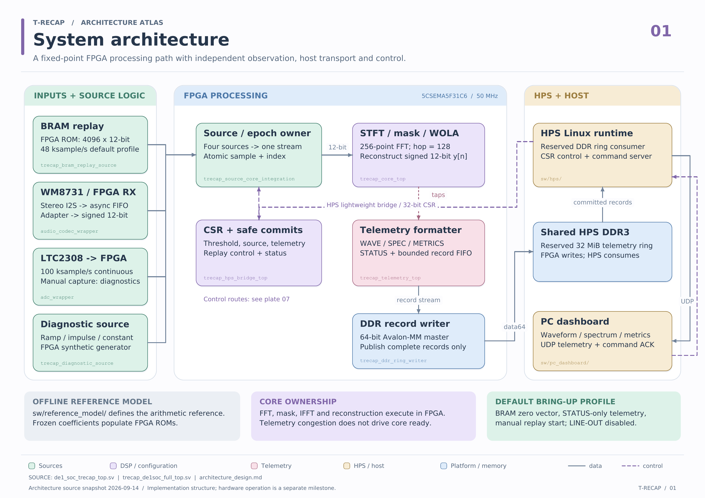

# Architecture atlas

We use these eight plates to explain how T-RECAP processes samples, observes the result, and connects the FPGA to Linux and the PC. The pastel groups identify responsibilities; each plate names the corresponding source modules and contracts.

[Browse the atlas](index.html) · [Download the vector PDF](trecap-architecture-atlas.pdf) · [Source snapshot manifest](atlas_manifest.json)

Open `index.html` locally for page navigation and zoom. GitHub can display the individual images and PDF; its repository file view does not run the HTML viewer. SVG and PDF retain vector detail, while the 3200-pixel-wide PNGs are convenient for reports and slides.



## Plates

| Plate | What it explains | SVG | PNG |
| --- | --- | --- | --- |
| 1. System architecture | Sources, FPGA processing, telemetry, DDR, HPS and PC ownership | [SVG](01-system-overview.svg) | [PNG](01-system-overview.png) |
| 2. DSP datapath and frame ownership | Windowing, FFT, canonicalization, masking, IFFT, WOLA and delayed-reference metrics | [SVG](02-dsp-pipeline.svg) | [PNG](02-dsp-pipeline.png) |
| 3. Transform engines and storage | Iterative butterflies, synchronous RAM ports, arithmetic stages and service budgets | [SVG](03-transform-memory.svg) | [PNG](03-transform-memory.png) |
| 4. Sample sources and stream epochs | BRAM, LINE-IN, ADC and diagnostic inputs; normalization and recovery | [SVG](04-sources-epochs.svg) | [PNG](04-sources-epochs.png) |
| 5. Observation and telemetry records | Valid-only taps, packetizers, record arbitration and bounded storage | [SVG](05-telemetry.svg) | [PNG](05-telemetry.png) |
| 6. DDR transport and pointer ownership | Write acceptance, reserved memory, producer/consumer pointers and UDP forwarding | [SVG](06-ddr-hps-transport.svg) | [PNG](06-ddr-hps-transport.png) |
| 7. Commands, CSRs and safe configuration | PC requests, HPS results, CSR ownership, safe commits and the codec grant | [SVG](07-control-plane.svg) | [PNG](07-control-plane.png) |
| 8. Clock, reset and CDC boundaries | Fabric clock, codec clocks, RX/TX crossings, reset ownership and physical budgets | [SVG](08-clocks-reset-cdc.svg) | [PNG](08-clocks-reset-cdc.png) |

## Reading the diagrams

- **Solid arrows** show forward data flow. DSP ready/backpressure return signals are omitted for readability; a solid arrow does not imply an unconditionally accepting destination.
- **Dashed arrows** show controls, commits, requests or results.
- **Dotted arrows** show valid-only observation. Telemetry cannot propagate backpressure into the numerical core.
- Mint identifies sources; lavender identifies DSP/configuration; rose identifies telemetry; sand identifies HPS/host software; blue identifies platform or memory responsibilities.
- Panels are logical groups, not a complete HDL instance tree. Clock boundaries are identified explicitly on plate 8; color alone does not imply a clock crossing.

The real board contains **one core**. `trecap_source_core_integration` owns source selection, stream epochs and `trecap_core_top`. The board's `trecap_de1soc_full_top` adds telemetry and the HPS/DDR shell. The standalone `trecap_core_telemetry_top` is an alternative composition, not another core in the board path. See [composition ownership](../core_telemetry_composition.md).

## Contracts behind the labels

### Samples, sources and arithmetic

The baseline accepts signed 12-bit samples and uses a 256-point transform, a 128-sample hop, fixed fractional precision `F = 15`, and a 384-sample causal delay. These are sample-domain quantities, not analog or network latency measurements. THR2 is a 56-bit magnitude-squared threshold; safe application and a frame-owned snapshot prevent a frame from mixing thresholds. Source selection has its own safe boundary.

The default [BRAM profile](../../../config/profiles/de1soc_bram_replay.json) uses the 4096-sample zero input at a nominal 48 ksample/s, explicit replay start and **STATUS-only telemetry**. The plates show the other implemented packetizers and sources as capabilities. LINE-IN is the primary live extension; continuous ADC is optional, and manual ADC capture is diagnostic. LINE-OUT is a separate best-effort path and is disabled in the shipped build profiles. Source changes and detected discontinuities require the source owner's epoch/recovery sequence.

The [software reference model](../../../sw/reference_model/README.md) defines finite-stream arithmetic and supplies coefficients and offline artifacts. It does not execute in the FPGA or provide an online second processing path. Historical package names containing `golden` do not imply sign-off. Suppression and retained spectral-energy ratios describe signal representation and potential downstream work; the baseline still performs its FFT/IFFT schedule and does not establish electrical power savings.

### Telemetry and DDR

Packetizers produce payloads and record metadata. The downstream record builder adds the 32-byte common header and DDR padding. Normal packets are packed little-endian; their CRC field is zero under the current contract. One forwarded normal record becomes one UDP datagram, with a maximum of 1200 bytes including the header.

| Type | Payload bytes | Interpretation |
| --- | --- | --- |
| WAVE | `16 + 6N`, `1 <= N <= 192` | Three int16 channels: delayed input, output and error |
| SPEC129 | 287 | 129 compressed magnitude-squared values and mask bits |
| SPEC64 | 268 | 64 bucket maxima with suppressed/eligible counts |
| METRICS | 56 | Error aggregates and eligible-bin statistics |
| STATUS | 72 | Core, source, threshold and transport state |

Spectrum compression is `clip16(mag2 >> spec_shift)`. The record scheduler locks a candidate through its final accepted beat. The FIFO has eight queued-record slots plus one capture slot and moves descriptors while payload stays in RAM. Packetizer, scheduler and FIFO losses accumulate in `packet_fifo_drop_count`; DDR writer losses use `dma_drop_count`. Observation-epoch changes discard partial collections while already-started records drain; a transport reset is a separate flush operation. Exact layouts are in the [packet contract](../../../spec/generated/packet_layouts.json).

The reserved ring occupies **32 MiB at `[0x3E000000, 0x40000000)`**, with 64-byte record alignment and a 64-byte guard. FPGA owns the 64-bit absolute producer pointer `W`; HPS owns the 64-bit consumer pointer `Rd`. HPS snapshots `W` and commits `Rd` through CSRs. WRAP consumes the remaining physical tail and is never forwarded. DDR padding is also omitted from UDP.

The platform wrapper's registered OKAY response means a legal request crossed the generated bridge's acceptance boundary. It does **not** establish later physical DRAM completion. Ring startup requires disable/drain, transport reset, ring configuration, `Rd=0`, a zero `W` snapshot and ordered writer/telemetry enable. Linux exposes the reserved region through a read-only, noncached, single-consumer `/dev/trecap-ring` mapping. See [ring ownership](../de1soc_ddr_ring_ownership.md) and [HPS transport](../de1soc_hps_transport.md).

### Network and reverse control

The direct-link defaults are HPS `192.168.10.2` and PC `192.168.10.1`. Telemetry targets PC UDP port **5005**. The PC command socket binds port **5007** and sends to HPS port **5006**. HPS validates and copies committed records before sending; UDP send failure is counted and still releases the consumed ring extent. A malformed record instead latches a transport fault and requires the defined restart lifecycle.

The current command client sends exact **28-byte v2 requests**. Non-PING commands receive **32-byte results** with APPLIED, NOOP, REJECTED or FAILED disposition. Identical retries return cached results without repeating the mutation. PING is the diagnostic STATUS exception. The HPS bridge accesses the 32-bit CSR interface at **`0xFF200000`**, within an explicitly decoded 4 KiB window. Network commands cannot supply arbitrary DDR addresses. See [command semantics](../de1soc_command_path.md).

The Linux platform driver owns HPS_GPIO48, holds it low to select the FPGA codec I2C path, and checks readback. HPS runtime then publishes the FPGA-visible grant through `PLATFORM_CONTROL[0]` at `0x184`. The FPGA reads that CSR grant rather than the dedicated HPS pin. [Grant ordering](../platform_grant.md) also defines teardown.

### Clocks and evidence

The source/DSP/telemetry/CSR/writer fabric runs at **50 MHz**. Sample and telemetry cadence pulses are clock enables. Audio serialization crosses through dedicated RX and optional TX asynchronous FIFOs; HPS DDR and peripheral clocks remain generated-system owned. Codec rates are nominal design rates, with PLL quantization and external assumptions documented in the [physical timing contract](../physical_timing.md).

The atlas describes implemented source architecture. Functional board runtime and matched HPS/Linux deployment remain pending milestones; diagrams are not evidence that those paths have operated end to end. Build, pin and timing evidence is recorded separately in the [implementation results](../../results/fpga_implementation.md).

## Regenerating the atlas

From the repository root, install ReportLab in the chosen Python environment and run the source-owned generator:

```bash
python -m pip install reportlab
python scripts/generate_architecture_atlas.py
```

The generator writes eight SVGs, the vector PDF, the HTML viewer and `atlas_manifest.json` to this directory. It accepts `--repo-root` and `--output` overrides. Rendering reads source references for hashes; it does not run the reference model, RTL simulation or Quartus.

PNG export is an optional separate step using Poppler's `pdftoppm`. For example, this exports plate 1 at 3200 pixels wide:

```bash
pdftoppm -f 1 -l 1 -singlefile -png -scale-to-x 3200 -scale-to-y -1 docs/architecture/diagrams/trecap-architecture-atlas.pdf docs/architecture/diagrams/01-system-overview
```

Repeat with pages 2 through 8 and the corresponding stems in the table. Regenerate PNGs after changing the vector plates so the formats agree.

The [manifest](atlas_manifest.json) records each plate's source references, the snapshot date and SHA-256 hashes of the referenced source/configuration files. It identifies the documentation snapshot, not a functional test result or a complete build-source archive. Review diagram labels when their referenced contracts change, then regenerate all published formats.
