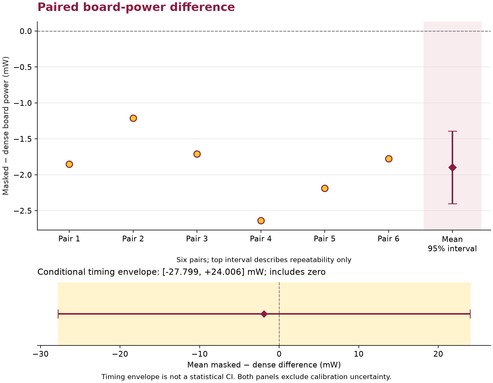
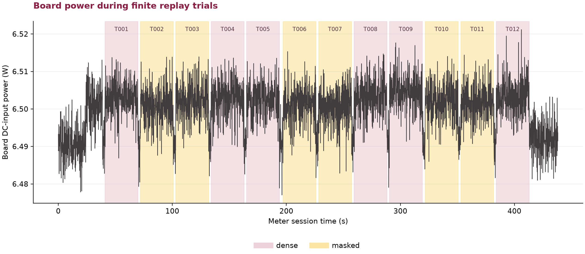
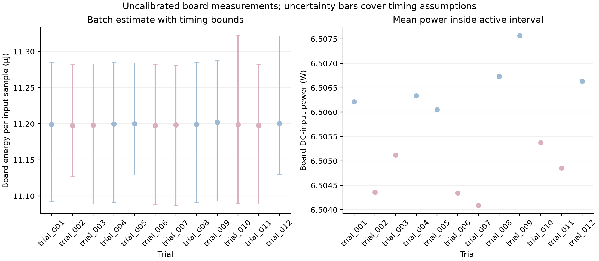

# T-RECAP board-power measurement

Date: 2026-09-25. Platform: DE1-SoC, Cyclone V 5CSEMA5F31C6. Configuration: standalone FPGA replay image without an HPS software workload.

## Observed result

Across six pairs, the mean masked-minus-dense difference in steady active board power was **-1.897 mW**, with a **95% paired repeatability interval of [-2.401, -1.393] mW**. The mean difference was **-0.0292%** of the dense-condition mean power. Positive values mean the masked setting drew more power. The repeatability interval excludes zero for these paired runs. It does not establish calibrated accuracy or generalize beyond this board, image, input, and operating conditions.

Propagating the per-trial timing bounds independently gives a **conditional timing envelope of [-27.799, +24.006] mW for the same mean power difference**. It includes zero, before adding calibration uncertainty. It is an interval from timing assumptions, not a statistical confidence interval. The small paired repeatability interval therefore does not establish a direction of power change after these timing allowances.

| Condition | Squared-magnitude threshold | Mean active board power (W) | Mean batch energy estimate (J) | Mean board energy/input estimate (µJ) |
|---|---:|---:|---:|---:|
| dense | 0 | 6.506589 | 187.9093 | 11.2003 |
| masked | 100,000,000,000 | 6.504692 | 187.8739 | 11.1982 |



The upper panel shows six paired observations and their mean. The upper panel interval describes variation between those pairs and excludes systematic calibration uncertainty. Batch-energy central values use interpolation; their conditional timing bounds appear in [the trial table](data/trials.csv).

**All 6 paired full-batch energy-difference bounds include zero. The direct batch-energy result therefore does not establish a direction of change within the stated timing bounds.** The small steady-active power difference does not by itself qualify an electrical energy-saving claim.

## What was run and checked

The campaign used twelve measured trials in ABBA order repeated three times. Each trial ran 16,384 epochs at a nominal 50 MHz. Every epoch replayed the same 1,024 input samples, produced 1,536 output samples including startup/tail output, and processed nine frames. Both conditions used 1,444,053,378 fabric cycles per trial, equivalent to 28.881068 nominal seconds. This is repeated finite replay, not a continuous externally paced stream.

The measured trials consumed **201,326,592 input samples** and checked **301,989,888 output samples**. All terminal counters matched and all on-chip reference comparisons reported **zero mismatches and zero fault flags**. Each output's index and value were compared with the reference ROM for its condition. This evidence covers these workloads; it is not whole-project verification signoff. The measurement-controller simulation separately passed **101 checks**, including repeated replay and injected faults.





The programmed image passed four timing corners. Minimum fabric setup slack was **+4.829 ns** and hold slack was **+0.070 ns**. Fitter use was **5,276 ALMs, 7,451 registers, 38 RAM blocks, and 30 DSP blocks**. These totals include the replay source, output checker, counters, and JTAG shell. The timing review retained vendor JTAG hard-primitive/interface exceptions; it did not identify an unknown fabric clockless endpoint.

## Measurement boundary and timing

An INA228 with its stock 15 mΩ shunt measured the board's DC supply. VBUS was connected upstream of the shunt, so the boundary includes the shunt and downstream wiring losses. The FPGA image, board background consumption, replay/checker logic, and attached board peripherals contribute to the reading. Feather USB power and the adapter's AC-to-DC conversion loss are outside this boundary. This is DC input energy, not wall-plug energy or a measurement of an individual FPGA rail.

The sensor used continuous bus/shunt conversion, 16 averages, and 280 µs per channel, with 10 Hz host logging. The final capture contains 4,382 valid rows and 212 matched clock exchanges. Hardware accumulated energy supplied the integral. A request/reply protocol bounded the correspondence between device time and the host clock; host brackets and fabric cycle counts located each batch. The longest recorded synchronization round trip was 1.516 s; the analysis retained timing uncertainty rather than assuming immediate USB delivery. The active-power calculation used only the guaranteed interior, trimmed by another 0.500 s at each end.

The analysis assumes device and fabric clock-rate bounds of 1000 ppm and 1000 ppm, respectively, and a 20 ms sensor effective-time guard. Host Tcl timestamps used a ±20 ms UTC-to-QPC guard. These are explicit engineering timing assumptions, not calibration certificates. Sensor gain/offset, shunt tolerance, temperature effects, and absolute calibration uncertainty remain outside those bounds. No idle-power subtraction is applied in this report.

## Output-quality tradeoff

The following error values come from the reference workload artifacts, not from the electrical meter. They compare reconstructed output with the input delayed by 384 samples and zero-padded outside its original extent. Metrics cover the full 1,536-sample output stream, including startup and tail regions.

| Condition | Reference RMSE (LSB) | Maximum absolute error (LSB) | Suppressed / eligible bins |
|---|---:|---:|---:|
| dense | 0.000 | 0 | 0/1152 |
| masked | 22.714 | 211 | 1072/1152 |

Both settings execute the same fixed FFT/IFFT schedule. Thresholding changes reconstructed output and arithmetic data activity; this experiment does not isolate a zero-aware compute-skipping implementation. A measured board-power difference by itself is not a general energy-saving result. Conclusions must retain the output-quality tradeoff and this board/workload boundary.

## Reproduction and provenance

The source input, reference output ROMs, coefficient files, build/program receipts, final capture, and admitted trial events were checked against recorded hashes before publication. The programmed SOF SHA-256 is `17f8d795ef46434ef83ccf9f81eb7e9728ab163ba5d3398c8cdec570a4d498d8`.

- [Condition summary](data/condition_summary.csv), [trial measurements and timing bounds](data/trials.csv), [paired differences](data/paired_power.csv), and [reference quality](data/reference_quality.csv).
- [Sanitized meter samples](data/meter_samples.csv), [clock exchanges](data/clock_sync.jsonl), and [admitted trial events](data/trial_events.json) preserve the original acquisition data without host paths or device identifiers.
- [Portable analysis](data/measurement_analysis.json) changes only the three source-path fields to names local to `data/`. Original source hashes and all numerical results are retained.
- [Provenance hashes](data/provenance.csv) identify retained evidence under `runs/measurement/20260925_fpga`. The run directory is ignored by Git; the published meter, sync, and trial files reproduce the timing/energy calculation without it.
- Implementation: [`platform/de1soc/measurement`](../../../platform/de1soc/measurement), [`sw/measurement/ina228`](../../../sw/measurement/ina228), and [`scripts/measurement`](../../../scripts/measurement).

With Python and Matplotlib available, run this command from the repository root, choosing a fresh output directory:

```text
python scripts/measurement/analyze_board_measurement.py --csv docs/results/board_power_20260925/data/meter_samples.csv --sync docs/results/board_power_20260925/data/clock_sync.jsonl --trials docs/results/board_power_20260925/data/trial_events.json --session 1 --baseline dense --candidate masked --device-rate-ppm 1000 --fabric-rate-ppm 1000 --sensor-time-guard-s 0.02 --launch-guard-s 1e-06 --interior-trim-s 0.5 --out runs/measurement/publication_recheck_20260925
```

Vector figures: [power timeline](board_power_timeline.pdf), [trial comparison](board_trial_comparison.pdf), and [paired power difference](paired_power_difference.pdf).

The plotted and tabulated values preserve source precision for reproducibility. Displayed decimal places do not imply calibrated measurement accuracy.
