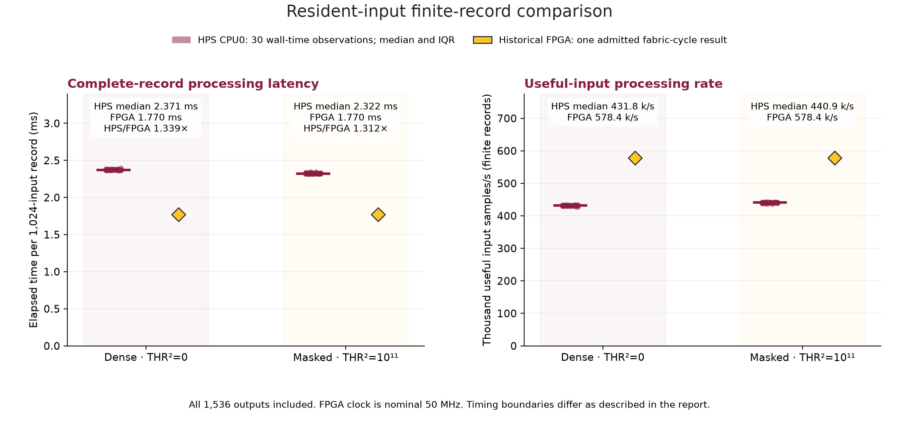

# HPS and FPGA resident-input finite-record timing

These results compare a physical DE1-SoC Cortex-A9 CPU0 run with the admitted historical FPGA measurement image. They measure complete 1,024-input records with nine frames and 1,536 reconstructed outputs, including startup and tail. Input, five coefficient tables, threshold and expected output identities match the independent qualification vectors.

| Condition | HPS median wall time (ms) | HPS interquartile range (ms) | Historical FPGA nominal time (ms) | HPS/FPGA time ratio |
| --- | ---: | ---: | ---: | ---: |
| dense | 2.3715 | 2.3691–2.3749 | 1.77048 | 1.339× |
| masked | 2.3224 | 2.3203–2.3264 | 1.77048 | 1.312× |

A ratio above one means the FPGA has shorter processing service time; below one means the HPS implementation has shorter service time. Ratios use HPS median wall time divided by FPGA cycles at nominal 50 MHz. They describe these implementations and this workload, not a general processor capability or an end-to-end accelerator speedup. Quartiles show the spread of 30 observations per threshold and are not confidence intervals.

| Condition | HPS median useful input samples/s | Historical FPGA nominal useful input samples/s |
| --- | ---: | ---: |
| dense | 431,795.1 | 578,374.2 |
| masked | 440,930.8 | 578,374.2 |

Rates divide the 1,024 useful inputs by complete-record processing time. They are finite-record processing rates, not a measured continuously paced stream rate or frame latency.

## What the timers include

The HPS benchmark uses preallocated workspace, resident input and coefficients, one pinned CPU, checked priming and warmup. Every timed trial executes one complete record, including logical state reset and an opaque output consumer. All 1,536 timed output values are checked after its timer stops. Range-checked executions before and after the trial verify the admitted workload; arithmetic guards, reference comparisons, quality metrics, file operations and allocation are outside the timed region. Wall time is the comparison metric; thread CPU time is retained separately and includes its enclosing timestamp calls.

The historical FPGA cycle counter runs from accepted shell command through terminal exact completion. Its 88,524 clocks include batch clear/init, all finite-record startup/tail work, parallel on-chip output checking/metrics and completion drain. It excludes JTAG latency and transfers between HPS memory and FPGA memory. **This boundary differs from the CPU datapath timer:** hardware checking and metrics remain active inside FPGA time while CPU comparisons and metrics are excluded. The result is a disclosed service-time comparison, not two identical instruction-level kernels.

The FPGA's repeated-record increment of 88,138 clocks is not substituted for the observed one-record result. No fresh FPGA run is claimed. FPGA timing belongs to the historical image identified by SHA-256 `17f8d795ef46434ef83ccf9f81eb7e9728ab163ba5d3398c8cdec570a4d498d8` and its retained programming/campaign receipts. The currently booted HPS software does not attest that image is presently loaded.

## Admission and interpretation limits

Both physical HPS conditions completed 30 single-record timing trials with exact full-output checks, CPU0 affinity applied and read back, arm32/armv7l execution and Cortex-A9 CPU identity. The executable/source and transferred input/expected/coefficient hashes are bound by the physical acquisition receipt. Native host qualification is separate and is not used as board timing evidence.

Clock-framework readings, governor availability and temperature availability are retained in [the summary](comparison_summary.json). A reported CPU clock rate is not an oscilloscope calibration; missing governor or thermal interfaces are not replaced with assumed values. The FPGA time uses nominal 50 MHz. No confidence interval or calibrated uncertainty is asserted for the ratio.

Thirty successive observations of an immutable workload with checked priming describe warmed local-memory execution. Operating-system interruptions can affect wall time and are retained in the individual observations. This experiment does not measure input transfer, launch/synchronization overhead, output return, application latency, energy, or a multicore/NEON-tuned CPU performance limit. It supports no energy-saving claim.

## Evidence

- [Summary, environment and source identities](comparison_summary.json).
- [All 60 HPS timing observations](arm_trials.csv).
- [Historical FPGA admissions and raw probes](historical_fpga_admissions.json).



[Vector PDF](latency_throughput.pdf).

Reproduce the published numbers and plots with `python docs/results/hps_cpu_benchmark_20260925/scripts/analyze_board_results.py --summary docs/results/hps_cpu_benchmark_20260925/comparison_summary.json --trials docs/results/hps_cpu_benchmark_20260925/arm_trials.csv --out runs/measurement/hps_public_replot`. This mode checks all CSV observations against the admitted summary, recomputes the statistics and does not re-admit hardware. No ignored acquisition files, FPGA binary or original publication-manifest schema are required.

Repeat the original evidence admission with `python docs/results/hps_cpu_benchmark_20260925/scripts/analyze_board_results.py --board-dir BOARD_RESULTS --vectors QUALIFICATION_VECTORS --fpga-jtag HISTORICAL_JTAG_JSONL --out NEW_REPORT_DIRECTORY`. The board directory contains `metadata.json`, `multitone_dense.json` and `multitone_masked.json`; historical source/build/program receipts must remain beside the original JTAG campaign. Matplotlib is required for figures; use `--no-plots` for numerical admission only.

## Implementation and physical qualification

The [CPU experiment package](../../../experiments/hps_cpu_benchmark/README.md) contains the exact C++ source, portable build instructions, frozen oracle vectors, and functional runners. The production reference model and RTL were not changed for this measurement. The ARM executable was built with GCC 13.3.0 using C++17, `-O3 -static -mcpu=cortex-a9 -mfpu=neon -mfloat-abi=hard -fno-lto`; compiler auto-vectorization was allowed. It uses one thread and does not contain handwritten NEON optimization.

Before timing, the native build and the physical ARM build each passed 19 complete-output cases and the defined empty-input rejection. The independently compared outputs total 24,448 samples per build. The cases cover multitone, silence, alternating extrema, positive/negative full-scale DC, broadband, boundary transients and short finite streams. During the subsequent 60 timing trials, all 92,160 timed output samples matched their expected values; checks before/after each trial additionally confirmed the arithmetic range assumptions.

The [physical acquisition receipt](data/metadata.json) records source/executable/workload hashes, UART acquisition identities, and build options. The CPU clock framework reported 925 MHz before and after the run. No CPU-frequency governor interface or thermal sensor interface was available; no value is invented for either. Linux and the benchmark ran from RAM after booting reviewed existing SD files. This experiment did not write the SD card or deploy the integrated HPS transport application.

### Public evidence and reproduction

- Unmodified ARM result JSON: [dense](data/multitone_dense.json), [masked](data/multitone_masked.json).
- [Complete physical qualification report](data/qualification_report.json), with original case exports under `data/qualification/`.
- [Native functional qualification summary](data/native_qualification_summary.json), excluded from all performance calculations.
- Board-reported clocks [before](data/clock_before.txt) and [after](data/clock_after.txt), [CPU identity](data/cpuinfo.txt), and [on-board file hashes](data/hashes.sha256).

From the repository root, recheck the physical output exports without a board:

```text
python experiments/hps_cpu_benchmark/scripts/verify_board_export.py --vectors experiments/hps_cpu_benchmark/vectors --result-dir docs/results/hps_cpu_benchmark_20260925/data/qualification --binary-sha256 c6242f02a997a883e85d7bc45ee5c8680dd753f4dfa6726ba8da2aeeb1374314 --output runs/measurement/hps_public_qualification.json
```

Create the output parent directory first. This command checks the archived functional outputs; it does not conduct a new hardware run. The executable's own JSON deliberately leaves physical-board attestation and clock rate unset: those properties are supplied by the separate acquisition receipt, rather than inferred from an ARM executable alone.

Full admission against the original programming/build/UART receipts uses the retained local `runs/measurement/20260925_hps_cpu` evidence and the original FPGA campaign. The public files reproduce the numerical comparison and functional checks. Local machine paths and hardware connection identifiers remain in the local archive; no passwords, network credentials, boot binaries, or unrelated project sources are published.

## Next measurement

The first resident-input comparison demonstrates shorter FPGA service time for this exact workload and CPU implementation. To evaluate the energy question, collect new CPU-versus-FPGA DC-input traces for equal useful work under the same Linux, interface, and board background conditions, using batches long enough for the meter and retaining launch/completion bounds. Historical FPGA-only power traces cannot be combined with the new CPU runtime to claim energy savings. A separate end-to-end offload study must include data transfer, launch and completion costs. Additional application signals and agreed reconstruction-quality limits are still needed for broader usefulness claims.

The acquisition order was 30 dense trials followed by 30 masked trials. It was not a randomized crossover study. The lower masked CPU median is a descriptive observation; this run does not isolate threshold choice as its causal explanation.
