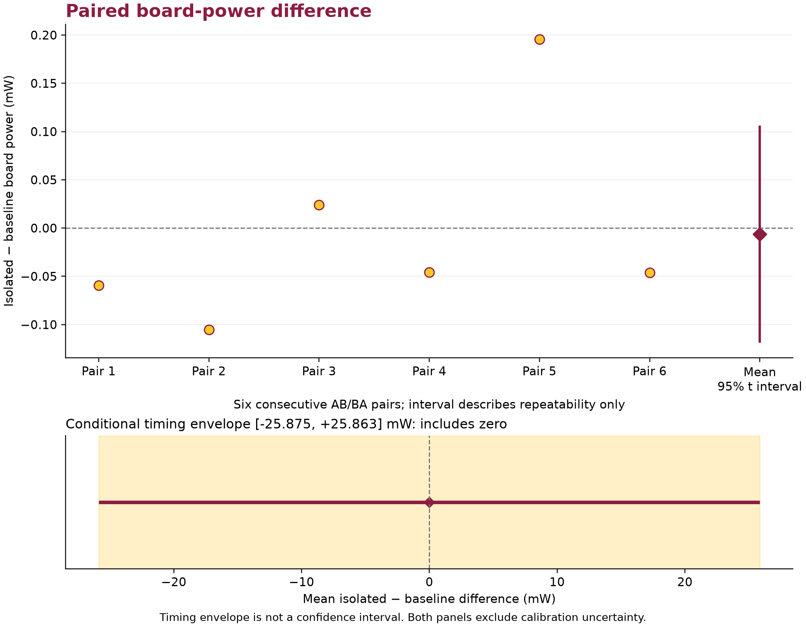
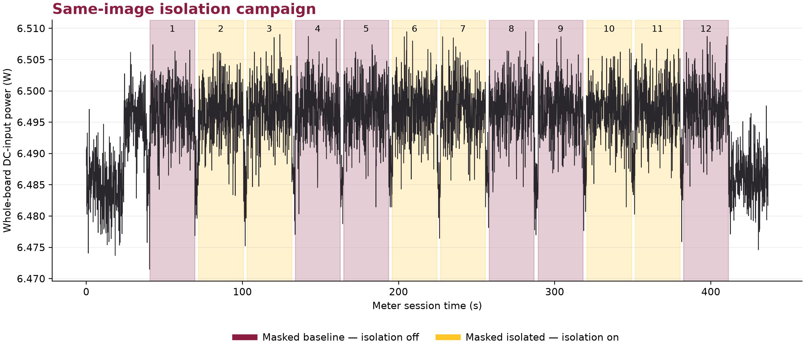
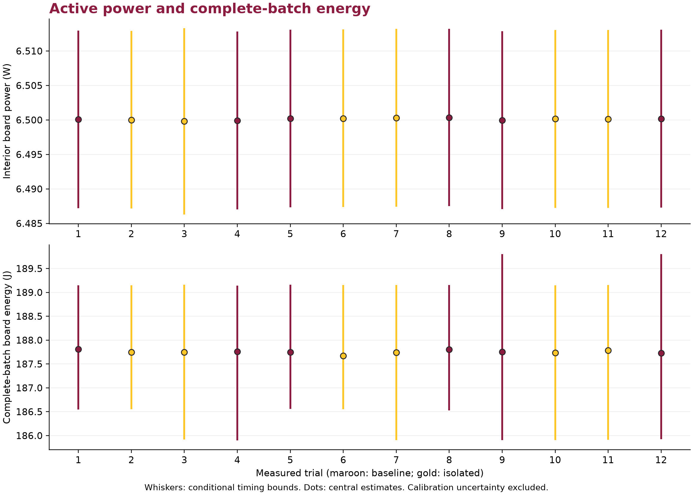

# IFFT zero-operand isolation: matched board experiment

Date: 2026-09-25. Platform: DE1-SoC, Cyclone V 5CSEMA5F31C6, standalone 50 MHz FPGA replay image. This report compares two operating modes in the same programmed image at the same squared-magnitude threshold, 100000000000: **masked_baseline** (isolation disabled) and **masked_isolated** (isolation enabled).

## Measured result

The mean isolated-minus-baseline difference in steady active board power was **-0.006 mW**, or **-0.0001%** of the baseline mean. The **95% paired repeatability interval was [-0.119, +0.106] mW** across six consecutive AB/BA pairs. Positive values mean the isolated mode drew more board-input power. The paired repeatability interval includes zero, so these six pairs do not resolve a consistent direction.

The **conditional timing envelope for that mean difference was [-25.875, +25.863] mW**. The conditional timing envelope includes zero; a direction of power change is not established after the stated timing allowances. This envelope propagates the stated timing bounds; it is not a statistical confidence interval. Both intervals exclude sensor/shunt calibration uncertainty, and neither supports generalization to other boards, images, workloads, temperatures, or supply conditions.

| Condition | Mean interior board power (W) | Mean complete-batch energy estimate (J) | Mean board energy/input estimate (µJ) |
|---|---:|---:|---:|
| masked_baseline | 6.500110 | 187.7670 | 11.1918 |
| masked_isolated | 6.500103 | 187.7367 | 11.1900 |

The mean paired complete-batch energy-difference timing envelope was **[-3.2450, +2.9273] J**. The mean paired batch-energy timing envelope includes zero; complete-batch energy savings are not established within those timing bounds. Central batch-energy values use interpolation of accumulated energy; the complete conditional bounds remain in [the trial table](data/trials.csv). No idle-power subtraction is applied.



## What changed

The optional registered IFFT butterfly detects an exactly zero complex twiddle-multiplied operand, b. With isolation enabled, the inputs of all four real multipliers retain the last accepted nonzero b/twiddle operands, product registers hold, and the following stage selects exact zero product sums. Reset and clear initialize the held operands. Nonzero butterflies follow the existing arithmetic path. The IFFT owns the selected mode from its first accepted frame sample until completion. The FFT and other pipeline stages retain their existing behavior.

Every butterfly state still executes. This implementation isolates multiplier switching opportunities; it does not skip cycles, shorten the IFFT schedule, or reduce the number of accepted butterflies. **There is no observed runtime gain:** both measured conditions took **1,444,053,378 fabric cycles per trial**, or **28.88106756 nominal seconds at 50 MHz**. This is repeated finite replay, not a continuous externally paced workload or HPS/DDR end-to-end benchmark.

The measured workload has 4,352 exactly zero twiddle-multiplied operands among 9,216 accepted IFFT butterflies per epoch (47.22%). At the same threshold, the four nonzero profiled synthetic/measured workloads span 1.18%–83.82%; this is workload-dependent arithmetic opportunity, not an energy-saving percentage. The profile checked 360 frames across 40 signal/threshold cases against the independent oracle.

The RTL monitor matched all five Python zero-count fields in 288 baseline and 576 candidate epoch/frame/stage rows. For the measured masked workload, zero-b counts by IFFT stage were **1072, 992, 832, 672, 336, 448, 0, 0**, each out of 1,152 accepted butterflies per epoch. Threshold suppression is distinct from these later arithmetic zeros; values spread and cancel as the transform progresses.

## Correctness, finite work, and timing

The twelve measured trials followed ABBA repeated three times, with two-second idle gaps, separate warmup, and a final acknowledged 20-second idle period. Each trial ran 16,384 finite epochs. Each epoch replayed the same 1,024 input samples, processed nine frames, and produced 1,536 output samples including startup/tail output. Across measured trials, **201,326,592 inputs** were consumed and **301,989,888 outputs** were checked. Terminal counters matched exactly, with **zero numerical mismatches and zero fault flags**. Both measured modes use the same expected masked-output ROM.

The final native verification suite checked 4,656 butterfly outputs across two rounding/output configurations, including directed extrema, cancellation, saturation, rounding ties, seeded random values, stalls, and reset/clear recovery. IFFT checks covered 8,192 outputs, 32 completed frames, six aborted frames, mid-frame control changes, and retained sticky status. Nineteen nonsaturating distinct frames also matched the independent recursive integer oracle; another frame exercised saturation. Paired full engines passed mode sequence 1→2→3→2 with two epochs per batch, exact output and handshake agreement, and 176,662 elapsed cycles per batch. These are bounded tests, not formal equivalence for every possible input or parameter combination.

All four fitted timing corners passed setup, hold, recovery, and removal at 50 MHz. Minimum setup slack was **+4.493 ns**, and minimum hold slack was **+0.092 ns**. The review verified twelve board pins and no fabric latches; remaining unconstrained endpoints were confined to the vendor JTAG serial interface. See [the selected build and verification summary](data/build_verification.json) and [simulation summary](data/verification_summary.json).

| Fitted image | ALMs | Registers | DSP blocks | M10K blocks |
|---|---:|---:|---:|---:|
| Prior baseline measurement image | 5,276 | 7,451 | 30 | 38 |
| Image with optional isolation support | 5,366 | 7,492 | 30 | 38 |
| Difference | +90 | +41 | 0 | 0 |

These totals include replay, checking, counters, and the measurement shell. **The same-image baseline/isolated comparison holds this added hardware present in both modes. It does not measure the net cost of adding the isolation hardware to the prior image.** The two separately fitted images differ in implementation; their area totals do not establish an isolated electrical effect.

## Measurement boundary and uncertainty

An INA228 with its stock 15 mΩ shunt measured the board's DC supply. VBUS was connected upstream of the shunt, so the boundary includes shunt and downstream wiring losses. FPGA activity, replay/checker logic, board background consumption, and board peripherals contribute to the reading. Feather USB power and adapter AC-to-DC conversion loss are outside the boundary. This is whole-board DC-input energy, not wall-plug energy or an individual FPGA-rail measurement.

The sensor used continuous bus/shunt conversion, 16 averages, and 280 µs per channel, with 10 Hz logging. The final capture contained **4,367 continuous valid rows** and **214 matched clock exchanges**. Overflow and memory diagnostics remained clear, and accumulated energy remained valid. The longest synchronization round trip was **0.020674 s**. The analysis retained request/reply timing bounds instead of assuming immediate USB delivery.

Host Tcl timestamps were mapped to global QPC through bracketed UTC/QPC anchors. Batch launch brackets, the last BUSY snapshot request, completion receipt, and fabric-cycle counts constrained each batch. Active power used the guaranteed interior with another 0.5 s removed at each edge. Assumptions were ±1000 ppm device clock rate, ±1000 ppm fabric clock rate, a 20 ms sensor effective-time guard, a 1e-06 s launch-crossing guard, and a ±20 ms Tcl timestamp guard. These are explicit engineering assumptions, not calibrated or certified bounds.

The paired t interval describes variation among six paired observations. The timing envelope is a deterministic propagation of those engineering assumptions. Neither includes sensor gain/offset, shunt tolerance, temperature effects, or absolute calibration uncertainty. The plotted decimal precision supports reproduction and does not imply calibrated accuracy.





## Reconstruction quality

Isolation preserves the masked arithmetic result exactly; it introduces no additional reconstruction loss in the admitted tests. Both modes share the reference masked workload's RMSE of **22.714 LSB**, maximum absolute error of **211 LSB**, and **1072/1152 suppressed eligible bins**. Error uses the input delayed by 384 samples and zero-padded outside its original extent, across the full 1,536-sample output stream. Those values characterize the existing thresholding tradeoff, not electrical-meter accuracy or an isolation-induced quality change.

## Reproduction and evidence

The [experimental source package](../../../experiments/ifft_zero_isolation/README.md) includes the reviewed RTL overlay, profiling data, SystemVerilog testbenches, host checks and activity-capture sources. It recreates a separate candidate source tree after checking baseline hashes. The production RTL remains unchanged; the optional experiment is not promoted as an energy-saving replacement.

The builder checks all campaign source/output hashes, analyzer source and analyzed-input hashes, candidate source inventory, programmed image/admission linkage, the four-corner timing table, and the frozen verification-manifest hash before generating this report. The programmed SOF SHA-256 is `4fe8b654fc6eba8ddbf8c72b52af3a5fe64feef27f51768b0abdd06cc4c07de6`. Raw host command lines, local filesystem paths, and device identifiers are not published.

- [Condition summary](data/condition_summary.csv), [trial data and timing bounds](data/trials.csv), and [paired differences](data/paired_power.csv).
- Original numeric [meter CSV](data/meter_samples.csv), [clock exchanges](data/clock_sync.jsonl), and [admitted trial events](data/trial_events.json).
- [Portable analysis](data/measurement_analysis.json): numeric values and source hashes are unchanged. Only the three source paths and the stale descriptive threshold-comparison scope are corrected; the transformation is recorded in [the publication manifest](publication_manifest.json).
- [Selected build evidence](data/build_verification.json), [bounded verification evidence](data/verification_summary.json), [meter configuration](data/meter_configuration.json), and [source provenance hashes](data/provenance.csv).
- Vector figures: [paired difference](paired_power_difference.pdf), [power timeline](board_power_timeline.pdf), and [trial power/energy](trial_power_energy.pdf).

Recompute the numerical analysis from a repository checkout with Python and Matplotlib, choosing a fresh output directory:

```text
python scripts/measurement/analyze_board_measurement.py --csv docs/results/ifft_zero_isolation_20260925/data/meter_samples.csv --sync docs/results/ifft_zero_isolation_20260925/data/clock_sync.jsonl --trials docs/results/ifft_zero_isolation_20260925/data/trial_events.json --session 1 --baseline masked_baseline --candidate masked_isolated --device-rate-ppm 1000 --fabric-rate-ppm 1000 --sensor-time-guard-s 20e-3 --launch-guard-s 1e-06 --interior-trim-s 0.5 --out runs/measurement/ifft_zero_publication_recheck
```

Report-builder invocation (all paths are supplied explicitly):

```text
python publish_zero_report.py --repo FROZEN_CANDIDATE --run-root RUN_ROOT --analysis ANALYSIS_JSON --csv METER_CSV --verification-manifest VERIFICATION_MANIFEST --profile-manifest PROFILE_MANIFEST --fitted-review FITTED_REVIEW --out NEW_REPORT_DIRECTORY
```

The public acquisition files reproduce the energy calculation. Regenerating the publication admission checks also requires the retained frozen source/build/program evidence; full private manifests are intentionally summarized rather than copied into this report.

## Fitted activity and Power Analyzer admission

The [fitted inspection](data/fitted_review_public.json) confirms the held-operand registers, multiplier input mux cones and additional enable logic in the implemented IFFT. The [Power Analyzer attempt](data/power_attempt_public.json) records activity-mapping coverage and its admission decision. No numerical modeled-power saving is admitted from this attempt; incomplete matched activity must not be substituted for an electrical result.
