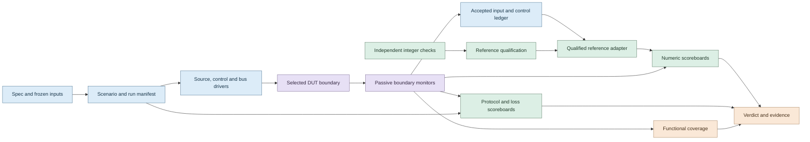

# Verification environment architecture

## 1. Scope and authority

We verify the existing fixed-point DSP core and the system that supplies,
observes, and transports its data. The baseline claim includes deterministic
BRAM replay, complete mathematical output checking, control, and DDR/HPS/PC
transport. LINE-IN is a separately qualified extension; the optional ADC and
audio output monitor do not silently become mandatory baseline requirements.

The integrated PDF and machine-readable contracts take precedence over this
verification design. Later documented interface extensions, including command
version 2, are checked under their own version. A disagreement between sources
creates a tracked decision, not an oracle copied from current RTL.

This architecture is a design only. The proposed directory roles below are not
claims that those agents, adapters, or regressions already exist.

## 2. Overall environment

The environment has three independent checking paths: exact numeric prediction,
protocol/lifecycle prediction, and evidence/coverage accounting. Simulation
monitors are passive; only the selected driver owns a DUT input.

The accepted ledger includes observations of DUT input/control boundaries,
not DUT-computed expected outputs. A source checker compares driver intent with
what was accepted; a control checker independently validates legal application
of writes. A wrong DUT frame index or threshold must fail those checkers rather
than redefine the predictor's expected frame.

## 3. DUT cuts and environment reuse

| Cut | DUT boundary | Main active agents | Required checking |
| --- | --- | --- | --- |
| REF | Public C++ arithmetic/frame/ring APIs | Frozen vectors and independent integer cases | Numerical qualification and artifact provenance |
| UNIT | Arithmetic, FIFO, scheduler, RAM-backed leaf modules | Operand or stream driver, reset, sink stalls | Exact arithmetic, ownership, local protocol |
| TRANSFORM | FFT256, IFFT256, canonicalizer, mask/builder | Complete frame/bin streams | Ordering, widths, metadata, exact frame results |
| CORE | `trecap_core_top` | Normalized samples, finite drain, core controls, output sink | Full waveform, bin/frame statistics, delay and metrics |
| SOURCE | `trecap_source_core_integration` | Replay/raw sources, control, readiness/fault injection | Source epochs, recovery, active/tail geometry |
| OBSERVER | `trecap_core_telemetry_top` and telemetry leaves | Source plus record sink/backpressure | Core noninterference, packet content and drop accounting |
| SYSTEM | `trecap_bram_replay_system_top` | CSR master, DDR slave, replay | Exact core closure plus record publication and completion |
| PERIPHERAL | Audio/ADC/clock and platform wrappers | WM8731/LTC2308 BFMs, clocks, reset, grant, bridge backend | Serial protocols and wrapper behavior |
| SOFTWARE | Real HPS and PC components behind controlled backends | Memory/CSR fixtures, UDP peer, commands | Parser, transport, retry and ownership |
| BOARD | Physical DE1-SoC deployment | Host capture/control and known BRAM vector | Real device, Linux, DDR visibility, complete captures |

Real top-level source files are listed in [module APIs](../architecture/module_api.md).
Every run manifest names its exact top, parameters, source list, defines, bound
monitors, BFM versions, and omitted vendor components. Passing a smaller cut
does not pass a larger one.

Keep common drivers, transaction definitions, and protocol monitors reusable.
Change the top-level composition and enabled checkers between cuts; do not
create a separate mathematical oracle per testbench. Leaf tests can inject
precisely chosen operands that a legal whole-core input cannot conveniently
produce.

## 4. Roles and dependency rules

| Role | Owns | Must not do |
| --- | --- | --- |
| Scenario coordinator | Named cases, deterministic seeds, legal constraints, finish policy | Drive pins directly through competing processes |
| Driver/BFM | One input interface, offered transactions, environmental timing | Assert a result is correct because it was driven |
| Passive monitor | Sampling actual handshakes/events and knownness | Change ready, valid, state, or the source clock |
| Input/control ledger | Accepted work and independently checked application events | Treat an offered but stalled beat as accepted |
| Reference adapter | Expected frame arithmetic and logical WOLA state | Implement FPGA RAM timing or trust DUT output values |
| Scoreboard | Matching identities, values, cardinality, protocol transitions | Discard unmatched transactions at normal completion |
| Coverage collector | Hits from observed/checked events and exclusions | Award coverage merely because stimulus was requested |
| Result collector | Manifest, failures, watchdogs, artifacts, final disposition | Convert skipped tests or missing evidence into success |

A protocol predictor models externally promised behavior, such as FIFO admission
and record atomicity, rather than every DUT FSM state. White-box probes may
localize a fault and verify hidden ownership; black-box input/output checks
remain the release-level authority.

## 5. Transaction identity

| Identity | Origin and lifetime | Why it is separate |
| --- | --- | --- |
| `reset_generation` | Environment counter on fabric hard reset | Hardware indices may restart |
| `source_epoch` | Source lifecycle transitions and restart | Different sources cannot share sample history |
| `raw_sequence` | Raw wrapper sequence | Physical samples can be dropped before DSP admission |
| `accepted_sample_idx` | Normalized input handshake within source epoch | Counts accepted work, not wall-clock periods |
| `frame_idx`, trigger index | Independently derived frame geometry plus observed admission | A frame can wait after its trigger |
| `config_version` and THR2 | Validated control application and frame admission | Queued frames retain their own threshold |
| `metric_epoch` | Applied metric clear/reset according to owner | Raw clear requests may wait |
| `candidate_id` | Verification-only ID before packet admission | A packet may be dropped before DDR sequence assignment |
| `transport_epoch`, absolute record start, `seq32` | Transport lifecycle and publication | WRAP and normal records have distinct sequence rules |
| Command peer/session/sequence | Host command session | Retries cannot cause repeated side effects |

These are verification metadata, not a request to change RTL ports or the UDP
ABI. Existing observable signals and the driver ledger supply them. Where
on-board data lacks an epoch identifier, constrain the capture to a known
session or leave the affected correlation unproven.

The canonical event envelope records schema version, run ID, source monitor,
clock domain, simulation tick, local cycle, event kind, relevant identities,
field widths/signedness, payload, and X/Z status. Use exact integers or explicitly
encoded hex/decimal strings. Never round 56/64-bit values through JSON floating
numbers. Sequence comparison rules are protocol-specific; Python's unbounded
integer ordering is not automatically the rule for wrapping hardware counters.

## 6. Sampling and scheduling contract

For ready/valid streams, consume exactly once when both signals are asserted at
the owning clock edge. A beat held while ready is low is still pending, not a
new transaction each cycle. Consecutive valid-and-ready edges accept consecutive
transactions even when their payloads are identical. Record payload stability
during stalls. Valid-only taps produce one observation
for each asserted event; no invented ready signal may throttle them.

In the core input, `sample_valid_i && sample_ready_o` is the acceptance boundary.
The packed sample struct also carries fields; each binding documents which
valid signal is authoritative instead of ORing duplicate validity fields.
Output acceptance is `y_valid_o && y_ready_i`. Unique-bin and frame taps follow
their actual event definitions, not the public-output handshake.

Use one explicit simulator scheduling convention: drivers settle before the
active edge; handshake monitors sample values used at that edge; state
observations follow registered updates and are tagged with that phase. Clocking
blocks are optional if qualified. Never mix pre-update and post-update signals
into a fictitious same-cycle transaction. RAM read latency and output buffering
are part of the interface adapter.

Each agent owns its own PRNG stream or uses a frozen stimulus schedule. Adding
an unrelated telemetry monitor must not change source stimulus. Record source,
stall, control, fault, and clock seeds separately.

Legal stress constrains maximum stalls and eventual clocks/responses. A separate
adversarial test can violate a stated assumption to verify fail-stop or rejection,
but cannot demand unspecified eventual completion. Both cycle and host-time
watchdogs apply.

## 7. Oracle and scoreboard composition

The numeric path has three roles:

1. An independent specification-based integer oracle checks rounding, widths,
   products, masks, geometry, and small known transform cases.
2. The qualified C++ reference produces exact frame/sample expectations using
   frozen coefficient bytes and public APIs.
3. Independent signal-quality analysis checks reconstruction quality against
   the aligned input. Floating transforms provide diagnostic sanity checks,
   not bit-exact expected fixed-point outputs.

The protocol path uses separate models for source admission/recovery, frame
configuration, delayed-history ownership, telemetry collection, FIFO admission,
DDR publication, and command lifecycle. Their clocks and epochs are explicit.

For static finite cases, precomputed expected artifacts support online SV
comparison and independent post-run comparison. For dynamic thresholds or
epochs, a frame-aware adapter reconstructs expected logical state from the
checked accepted-input/control ledger; it does not repeatedly restart the batch
model on arbitrary chunks. The adapter itself needs tests and independent
geometry checks before it becomes an oracle.

A mismatch report gives the first failing boundary, expected and actual identity,
values/widths, applicable configuration, previous accepted events, and relevant
waveform interval. Continue only enough to preserve diagnostic evidence; later
differences caused by one missing frame are not reported as unrelated bugs.

## 8. Testbench self-verification and completion

Every required checker has a deliberate failing self-test: corrupt a value,
index, threshold association, count, byte, or terminal event and confirm the
correct checker rejects it. An assertion must be observed enabled and triggered
in its qualification case. Success with an empty input file is a failure of the
environment, not a successful DUT test.

For a finite positive test, completion requires the independently expected
transaction cardinalities, empty required scoreboards, no unexplained in-flight
work, no unexpected error/drop flags, and the correct completion event. Observe
a post-completion quiet interval derived from the relevant pipeline/queue bound;
do not universally reuse a short historical fixed delay. An intentionally stalled
sink is released before asking for a positive completion verdict.

A negative test declares the injected violation, allowed response, expected
checker/flag, and termination condition in advance. Unrelated failures still
fail the test. Resets explicitly cancel only work owned by their reset scope,
with an abort record in the ledger.

## 9. Planned implementation ownership

| Future area | Responsibility |
| --- | --- |
| `sim/` environment, agents, monitors and assertion binds | Native SV DUT interaction and event capture |
| `sim/` scenario definitions and reference adapters | Isolated orchestration, expected artifacts, complete post-checks |
| `sw/reference_model/tests/` | Independent qualification of the public reference API |
| `sw/hps/tests/` and dashboard tests | Host protocol/transport components |
| Ignored `runs/` and `build/` | Immutable per-run evidence and isolated simulator libraries |
| `docs/verification/` | Requirements, cases, coverage definitions, decisions and signoff rules |

These are ownership boundaries, not new files created by this design. Reuse
existing assets only through the admission process in
[coverage and signoff](coverage_and_signoff.md). No automatic reference-artifact
regeneration, Git publication, tool installation, or RTL optimization belongs to
verification setup.
