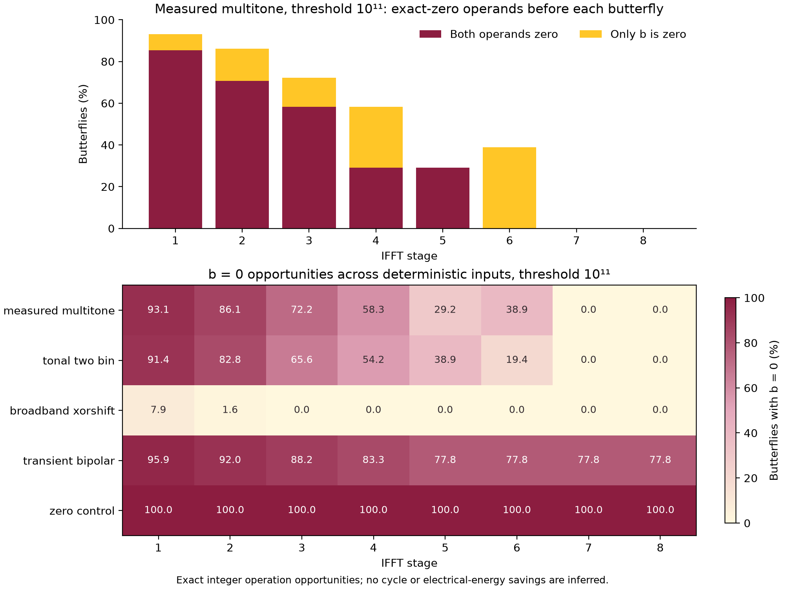

# IFFT exact-zero opportunity study

The measured multitone workload has **4,352 zero-valued multiplier operands among 9,216 IFFT butterflies (47.22%)** at a squared-magnitude threshold of `100000000000`. The corresponding unmasked workload has none. This motivates testing operand isolation while keeping the masked input, numerical result and execution schedule identical. It does not establish an electrical power reduction.

The reproducible data are in [results_01](results_01/manifest.json). Forty cases cover five deterministic signals and eight thresholds. All 360 independently replayed IFFT frames match the recursive integer oracle exactly, with zero mismatches. The original multitone reconstructions at thresholds `0` and `100000000000` also match the existing dense and masked measurement reference ROMs exactly.

## What is counted

Each case contains 1,024 real input samples, nine 256-point frames and 1,536 reconstructed output samples including startup and tail. Each frame executes eight radix-2 stages with 128 butterflies per stage: 9,216 butterflies per case, or 1,152 for each stage aggregated across frames.

The profiler loads the masked complex spectrum at bit-reversed addresses and independently replays the RTL's stage/base/j order. It applies Q15 rounding to nearest with ties away from zero, uses the frozen inverse twiddle coefficients, checks the 36-bit intermediate range, and performs no per-stage normalization. Every resulting complex frame is compared with the independent recursive oracle before the case is admitted.

For a butterfly `u = a + b*w`, `v = a - b*w`, `b_complex_zero` counts an exactly zero complex `b` before the transaction. Then `b*w` is exactly zero and both outputs equal `a`. `both_complex_zero` is the subset where `a` is also zero. Component-zero, zero-real-product and axis-twiddle counters overlap these counts and must not be added as separate savings.

Thresholding compares integer `re*re + im*im` strictly below the selected threshold. DC is protected, Nyquist is eligible, and each conjugate partner follows the same decision. There are 128 eligible unique bins per frame, or 1,152 per case. Threshold units are squared internal fixed-point magnitude, not volts or decibels.

## Results at threshold 100000000000

| Input | Suppressed eligible bins / 1,152 | Zero `b` / 9,216 | Zero `b` fraction | Both operands zero / 9,216 | Full-stream RMSE (LSB) | Maximum absolute error (LSB) |
| --- | ---: | ---: | ---: | ---: | ---: | ---: |
| Original measured multitone | 1,072 | 4,352 | 47.22% | 3,141 | 22.714 | 211 |
| Deterministic two-tone signal | 1,053 | 4,059 | 44.04% | 2,936 | 21.560 | 243 |
| Deterministic broadband signal | 91 | 109 | 1.18% | 15 | 25.451 | 111 |
| Sparse bipolar transients | 1,105 | 7,725 | 83.82% | 5,972 | 57.736 | 1,530 |
| All-zero control | 1,152 | 9,216 | 100.00% | 9,216 | 0.000 | 0 |

Errors are measured against the **384-sample-delayed, zero-padded input** over all 1,536 output samples. They quantify threshold-induced reconstruction error in the reference computation; they are not differences between baseline and isolated RTL. The synthetic signals are deterministic stress cases, not a representative application corpus. Their exact integer generation rules and input hashes are recorded in the manifest.

For the measured multitone, the zero-operand distribution is concentrated in early IFFT stages:

| Stage | Zero `b` / 1,152 | Both operands zero / 1,152 |
| --- | ---: | ---: |
| 1 | 1,072 | 983 |
| 2 | 992 | 814 |
| 3 | 832 | 672 |
| 4 | 672 | 336 |
| 5 | 336 | 336 |
| 6 | 448 | 0 |
| 7 | 0 | 0 |
| 8 | 0 | 0 |

Although 93.06% of eligible unique bins are suppressed, only 47.22% of the executed butterflies have zero `b`. Values spread and can cancel during the IFFT. Of the 4,352 zero-`b` transactions, 2,718 also use an axis twiddle and 1,634 use a nontrivial twiddle. These are overlapping arithmetic opportunities, not counts of hardware operations already removed.

Natural zeros also occur without threshold suppression: the transient case has 5,096 zero-`b` butterflies at threshold zero, the two-tone case has 35, and the all-zero control has 9,216. This distinguishes an exact operand test from a mask flag.



[Vector PDF of the figure](results_01/ifft_zero_opportunities.pdf)

## Limits and next experiment

Operand isolation can hold multiplier input registers during zero-`b` transactions and select the exact zero product. Its benefit depends on what synthesis maps into the DSP blocks, existing zero-operand behavior, the added detector/multiplexer/control logic, and the resulting switching activity. These model counts cannot predict a percentage power reduction. A fixed-schedule implementation does not shorten the batch or remove the remaining FFT, memory, windowing, WOLA and board activity.

The relevant implementation comparison is **masked baseline versus masked isolated IFFT at the same threshold, input and output quality**. Both paths must produce exactly the same full output stream, report the same arithmetic/fault behavior, and retain the same valid/ready timing and finite batch cycle count. Comparing threshold zero with threshold `100000000000` changes reconstruction quality and does not isolate this implementation change.

RTL transaction counts should first be reconciled with the per-frame and per-stage CSV. Functional, handshake, reset and fault behavior then need verification, followed by synthesis resource/timing checks and a paired board measurement with explicit timing uncertainty. Any subsequent board result applies to that measured implementation and workload. This package contains no RTL simulation result, timing result, calibrated power measurement or energy-saving claim.

## Data and reproduction

| File | Contents |
| --- | --- |
| [profile_ifft_zeros.py](profile_ifft_zeros.py) | Portable independent iterative replay and report generator |
| [results_01/manifest.json](results_01/manifest.json) | Geometry, scope, signal definitions, thresholds, source and input hashes |
| [results_01/case_summary.csv](results_01/case_summary.csv) | 40 case totals, reconstruction errors and output hashes |
| [results_01/stage_counts.csv](results_01/stage_counts.csv) | 320 case/stage aggregates |
| [results_01/frame_stage_counts.csv](results_01/frame_stage_counts.csv) | 2,880 case/frame/stage rows for an RTL transaction monitor |
| [results_01/frame_checks.csv](results_01/frame_checks.csv) | 360 exact frame comparisons and hashes |
| [results_01/bin_masks.csv](results_01/bin_masks.csv) | 46,440 unique-bin decisions, including DC and Nyquist |
| [results_01/inputs](results_01/inputs/) and [results_01/outputs](results_01/outputs/) | Frozen input and reconstructed output MEMH files |

From the directory containing this README, using a repository checkout with the source hashes listed in the manifest:

```text
python profile_ifft_zeros.py --repo <repository-root> --out <new-output-directory>
```

The output directory must be new. Plot generation requires Matplotlib; add `--no-plots` for standard-library-only numerical reproduction. The default sweep is `0`, `1e8`, `1e9`, `1e10`, `1e11`, `1e12`, `1e13`, and `2^56-1`. The manifest identifies the exact profiled source revision through file hashes; later RTL changes are a separate experiment.
